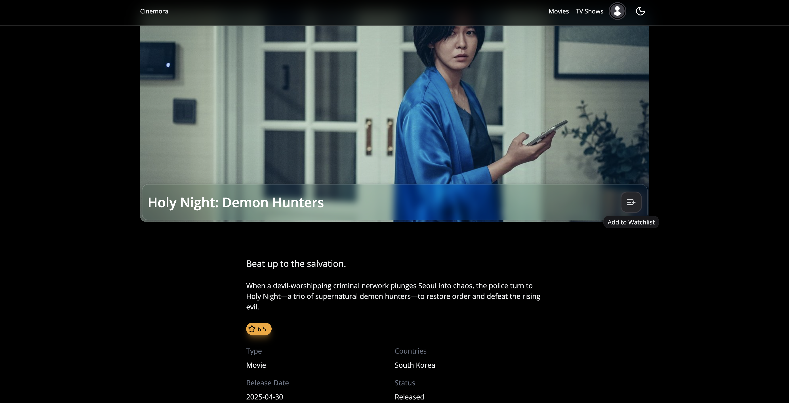
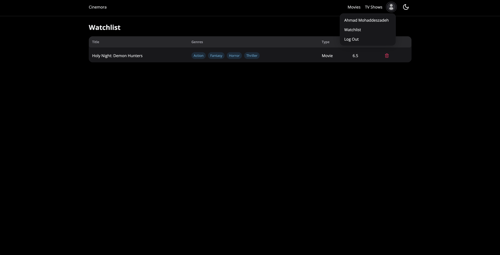
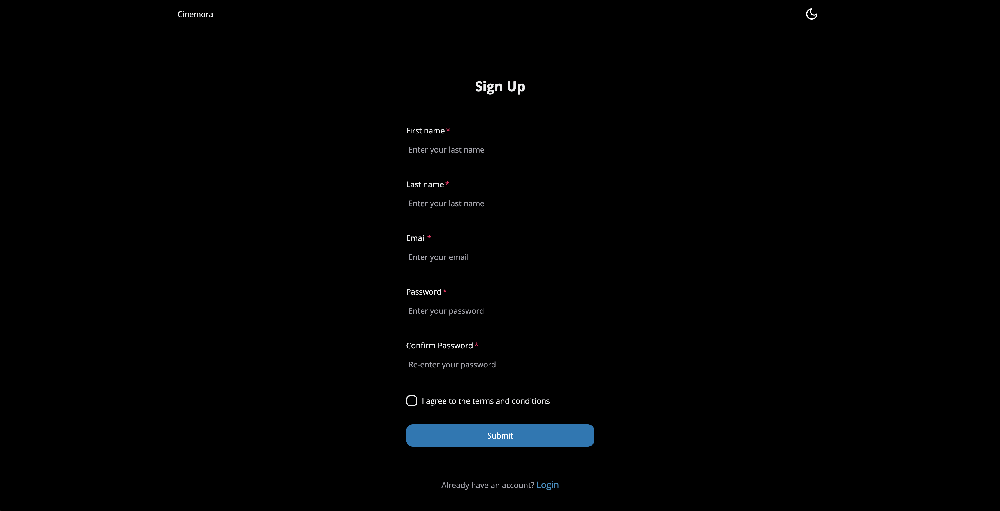

# 🎬 Cinemora

> Your personal movie and TV show watchlist application

[](https://nextjs.org/)
[](https://www.typescriptlang.org/)
[](https://supabase.com/)
[](LICENSE)

A full-stack web application for discovering, tracking, and managing your favorite movies and TV shows. Built with modern technologies and integrating with The Movie Database (TMDB) API.

## ✨ Features

### 🔐 User Authentication

- Secure email/password authentication with Supabase
- Email verification for new accounts
- Protected routes and user sessions
- Row-level security in PostgreSQL

### 🎥 Media Discovery

- Browse trending movies and TV shows
- Search and filter by:
  - Genre
  - Release year
  - Country of origin
  - Language
  - Popularity, rating, or release date
- Detailed information pages with:
  - High-quality posters and backdrops
  - Ratings and reviews
  - Release dates and genres
  - Overview and taglines

### 📋 Personal Watchlist

- Add movies and TV shows to your watchlist
- Mark items as watched/not watched
- View and manage all watchlist items
- Persistent storage with PostgreSQL

### 🎨 User Experience

- Responsive design for all devices
- Dark/Light mode support
- Smooth animations and transitions
- Modern UI with HeroUI components
- Optimized performance with Next.js Server Components

## 🛠️ Tech Stack

### Frontend

- **Next.js 15** - React framework with App Router
- **React 19** - UI library
- **TypeScript** - Type-safe development
- **Tailwind CSS v4** - Utility-first CSS framework
- **HeroUI** - Modern UI component library

### Backend

- **Next.js API Routes** - RESTful API endpoints
- **Supabase** - Backend-as-a-Service
  - PostgreSQL database
  - Authentication
  - Row Level Security
- **TMDB API** - Movie and TV show data

### DevOps & Tools

- **Git** - Version control
- **Vercel** - Deployment platform (recommended)
- **Axios** - HTTP client

## 🚀 Getting Started

### Prerequisites

- Node.js 18+ and npm/yarn/pnpm
- Supabase account ([Sign up here](https://supabase.com))
- TMDB API key ([Get one here](https://www.themoviedb.org/settings/api))

### Installation

1. Clone the repository

```bash
git clone https://github.com/iamahmadmhd/cinemora.git
cd cinemora
```

2. Install dependencies

```bash
npm install
# or
yarn install
# or
pnpm install
```

3. Set up environment variables

Create a `.env.local` file in the root directory:

```env
# Supabase
NEXT_PUBLIC_SUPABASE_URL=your_supabase_project_url
NEXT_PUBLIC_SUPABASE_ANON_KEY=your_supabase_anon_key

# TMDB API
NEXT_PUBLIC_TMDB_API_URL=https://api.themoviedb.org/3
TMDB_API_KEY=your_tmdb_api_bearer_token
NEXT_PUBLIC_TMDB_IMAGES_URL=https://image.tmdb.org/t/p

# App
NEXT_PUBLIC_API_URL=http://localhost:3000
```

4. Set up Supabase database

Run the migrations in the `supabase/migrations` folder:

```bash
# If using Supabase CLI
supabase db push

# Or manually execute the SQL files in your Supabase dashboard
```

5. Run the development server

```bash
npm run dev
```

Open [http://localhost:3000](http://localhost:3000) in your browser.

## 📁 Project Structure

```text
cinemora/
├── src/
│   ├── app/                    # Next.js App Router
│   │   ├── (auth)/            # Authentication routes (login, signup)
│   │   ├── (dashboard)/       # Protected dashboard routes
│   │   ├── (media)/           # Media browsing routes (movies, TV shows)
│   │   ├── api/               # API routes
│   │   └── actions.ts         # Server actions
│   ├── components/            # React components
│   ├── providers/             # Context providers (Auth, Theme)
│   ├── styles/               # Global styles and Tailwind config
│   ├── types/                # TypeScript type definitions
│   └── utils/                # Utility functions and helpers
├── supabase/                  # Supabase configuration and migrations
│   ├── migrations/           # Database migration files
│   └── config.toml           # Supabase local config
└── public/                    # Static assets
```

## 🎯 Key Features Implementation

### Authentication Flow

- User registration with email verification
- Secure password-based login
- JWT-based session management
- Protected routes with middleware
- Row-level security policies in PostgreSQL

### API Integration

- Server-side TMDB API calls for security
- Efficient data fetching with Next.js Server Components
- Genre mapping and data transformation
- Pagination support for large datasets

### Database Schema

- **profiles** - User profile information
- **watchlists** - User's saved movies and TV shows with status tracking

## 🌐 Deployment

### Deploy to Vercel (Recommended)

1. Push your code to GitHub
2. Import your repository in Vercel
3. Add environment variables in Vercel dashboard
4. Deploy!

[](https://vercel.com/new/clone?repository-url=https://github.com/iamahmadmhd/cinemora)

### Environment Variables for Production

Make sure to add all environment variables from `.env.local` to your deployment platform.

## 📸 Screenshots

### Landing Page


### Movies Browse


### Movie Detail



### Watchlist



### Authentication



## 🔮 Future Enhancements

- [ ] Social features (share watchlists, follow users)
- [ ] Personalized recommendations based on watch history
- [ ] Advanced search with filters
- [ ] Export watchlist to CSV/PDF
- [ ] Integration with streaming service APIs
- [ ] Mobile app (React Native)
- [ ] PWA support for offline functionality

## 🤝 Contributing

Contributions are welcome! Please feel free to submit a Pull Request.

## 📄 License

This project is licensed under the MIT License - see the [LICENSE](LICENSE) file for details.

## 👏 Acknowledgments

- [The Movie Database (TMDB)](https://www.themoviedb.org/) for providing the API
- [Supabase](https://supabase.com/) for the backend infrastructure
- [HeroUI](https://heroui.com/) for the beautiful UI components
- [Next.js](https://nextjs.org/) team for the amazing framework

## 📞 Contact

Ahmad Mohaddeszadeh - [@iamahmadmhd](https://github.com/iamahmadmhd)

Project Link: [https://github.com/iamahmadmhd/cinemora](https://github.com/iamahmadmhd/cinemora)

---

⭐ If you found this project helpful, please consider giving it a star!
